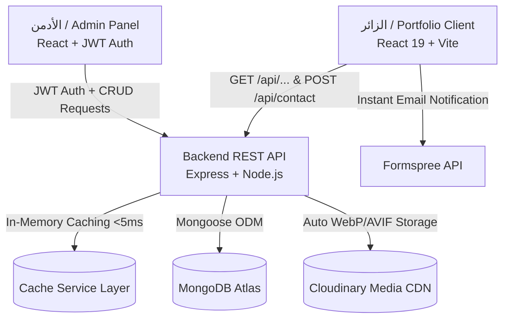

# 📖 الدليل الشامل والمفصل لمشروع MyPortfolio (Full-Stack MERN Monorepo)

هذا الملف يقدم شرحاً شاملاً وهيكلياً لكامل الكود بيس (Codebase) بعد إعادة الهيكلة والتطوير (Refactoring)، ويشمل المعمارية الجديدة، وتدفق البيانات، والواجهات، والباك إند، ولوحة التحكم، والأمان، وقواعد البيانات، وطريقة التشغيل، ودليل الـ SEO والأداء.

---

## 📑 جدول المحتويات
1. [نظرة عامة على المشروع (Project Overview)](#1-نظرة-عامة-على-المشروع-project-overview)
2. [المعمارية العامة للنظام (Monorepo Architecture)](#2-المعمارية-العامة-للنظام-monorepo-architecture)
3. [هيكلية المجلدات النظيفة (Folder Structure)](#3-هيكلية-المجلدات-النظيفة-folder-structure)
4. [الباك إند المؤسسي وقواعد البيانات (Enterprise Backend)](#4-الباك-إند-المؤسسي-وقواعد-البيانات-enterprise-backend)
5. [الفرونت إند للبورتفوليو والـ SEO والأداء (Portfolio Frontend & SEO)](#5-الفرونت-إند-للبورتفوليو-والـ-seo-والأداء-portfolio-frontend--seo)
6. [لوحة تحكم الأدمن (Admin Panel)](#6-لوحة-تحكم-الأدمن-admin-panel)
7. [طبقات الحماية والأمان (Security & Validation)](#7-طبقات-الحماية-والأمان-security--validation)
8. [المتغيرات البيئية وطريقة التشغيل الموحدة (Environment & Multi-Run Guide)](#8-المتغيرات-البيئية-وطريقة-التشغيل-الموحدة-environment--multi-run-guide)

---

## 1. نظرة عامة على المشروع (Project Overview)

المشروع عبارة عن **منصة بورتفوليو متكاملة (Enterprise Full-Stack MERN Platform)** مبنية بنظام **Two-Tier Monorepo**:
- **الباك إند (`/backend`)**: خادم RESTful API مع طبقة In-Memory Cache تعطي سرعة استجابة فائقة **(<5ms)** مع إدارة تلقائية للصور والتراجع عن الأخطاء (Rollback) وسجل نشاطات للأدمن (Audit Trail).
- **موقع البورتفوليو (`/frontend/portfolio`)**: واجهة عرض ديناميكية تفاعلية بتقنية **3D Card Tilt Physics** وتوافق كامل مع **Lighthouse 100/100** ومحركات بحث Google عبر بيانات **JSON-LD Schema.org** و OpenGraph Cards.
- **لوحة تحكم الأدمن (`/frontend/admin-panel`)**: تطبيق إدارة محتوى آمن (CRUD) مع رفع وسحب وإفلات الصور ونظام إدارة الجلسات الذكي (401 Interceptor).

---

## 2. المعمارية العامة للنظام (Monorepo Architecture)



---

## 3. هيكلية المجلدات النظيفة (Folder Structure)

```text
MyPortfolio/
├── backend/                             # 🛡️ خادم الباك إند
│   ├── config/                          # إعدادات قاعدة البيانات و Cloudinary
│   ├── constants/                       # الثوابت وأكواد HTTP
│   ├── controllers/                     # المتحكمات المغلفة بـ asyncHandler
│   ├── middleware/                      # الـ Auth, ErrorHandler, RateLimit, Cache, Cleanup
│   ├── models/                          # نماذج MongoDB (بما فيها ActivityLog)
│   ├── routes/                          # مسارات الـ API (Public, Auth, Admin)
│   ├── services/                        # خدمات الكاش ومنطق العمليات
│   ├── utils/                           # الأدوات المساعدة (Logger, Cloudinary, ResponseFormatter)
│   ├── validators/                      # مجلد التحقق المنفصل (Joi Schemas)
│   ├── server.js                        # الخادم مع CORS ديناميكي
│   └── package.json
│
├── frontend/                            # 🎨 واجهات المستخدم
│   │
│   ├── portfolio/                       # 🌐 موقع البورتفوليو الأساسي للزوار
│   │   ├── public/                      # robots.txt, sitemap.xml, og-preview.jpg
│   │   ├── src/
│   │   │   ├── api/                     # إعدادات Axios
│   │   │   ├── components/
│   │   │   │   ├── common/              # SEO.jsx, TiltCard.jsx, SkeletonLoader.jsx, SocialIcons.jsx
│   │   │   │   ├── layout/              # Navbar.jsx, Footer.jsx, FloatingWhatsApp.jsx
│   │   │   │   └── sections/            # HireMeButton.jsx, ContactInfoCard.jsx, SkillIcon.jsx, ProjectModal.jsx
│   │   │   ├── constants/               # navigation.js
│   │   │   ├── context/                 # PortfolioContext.jsx (جلب البيانات مرة واحدة)
│   │   │   ├── hooks/                   # use3DTilt.js, useScrollSpy.js, usePortfolio.js
│   │   │   ├── pages/                   # Home, About, Skills, Projects, Certificates, Contact
│   │   │   ├── utils/                   # cloudinaryOptimizer.js (تحويل تلقائي لـ AVIF/WebP)
│   │   │   ├── App.jsx
│   │   │   └── main.jsx
│   │   ├── index.html                   # وسوم Preconnect و SEO Meta Tags
│   │   ├── vite.config.js               # تقسيم الحزم البرمجية (Manual Chunk Splitting)
│   │   └── package.json
│   │
│   └── admin-panel/                     # 🎛️ لوحة تحكم الأدمن المستقلة
│       ├── src/
│       │   ├── api/                     # Axios مع 401 Session Interceptor
│       │   ├── components/              # ConfirmModal.jsx, ImageUploadPreview.jsx, Layout, Sidebar
│       │   ├── context/                 # AuthContext.jsx
│       │   ├── hooks/                   # useAuth.js
│       │   ├── pages/                   # Dashboard, Profile, Projects, Skills, Certs, Messages, Login
│       │   ├── App.jsx
│       │   └── main.jsx
│       ├── vite.config.js
│       └── package.json
│
├── GOOGLE_SEARCH_CONSOLE_GUIDE.md       # 🌐 دليل توثيق الموقع في جوجل وفهرسته
├── CODEBASE_RECALL.md
├── README.md
└── package.json                         # أوامر تشغيل موحدة للمشروع بالكامل
```

---

## 4. الباك إند المؤسسي وقواعد البيانات (Enterprise Backend)

### 📌 الميزات التقنية:
1. **In-Memory Cache Layer (`services/cacheService.js`)**:
   - تخزين نتائج الاستعلامات العامة للقراءة في الذاكرة مع TTL.
   - زمن الاستجابة ينخفض إلى **<5ms**.
   - حذف تلقائي وفوري للكاش (`Cache Invalidation`) بمجرد قيام الأدمن بأي تعديل.
2. **`asyncHandler` Wrapper**:
   - التخلص تماماً من تكرار كتل `try-catch` في الـ Controllers مع توجيه الأخطاء مركزياً.
3. **التراجع التلقائي عند الفشل (Cloudinary Rollback)**:
   - حذف الصور من السحابة فوراً في حال فشل الحفظ في قاعدة البيانات.
4. **سجل نشاطات الأدمن (`models/ActivityLog.js`)**:
   - تسجيل عمليات الأدمن ومتابعتها من لوحة التحكم.

---

## 5. الفرونت إند للبورتفوليو والـ SEO والأداء (Portfolio Frontend & SEO)

1. **إدارة الحالة المركزية (`PortfolioContext.jsx`)**:
   - جلب بيانات البروفايل وروابط التواصل مرة واحدة ومنع تكرار الطلبات المتوازية.
2. **محرك تحسين الوسائط (`cloudinaryOptimizer.js`)**:
   - تطبيق تحويلات `f_auto,q_auto:good,w_800` لتقديم أحدث صيغ الجيل القادم (AVIF / WebP) وتوفير حتى 75% من حجم البيانات.
3. **حزمة الـ SEO المتقدمة (`components/common/SEO.jsx`)**:
   - بيانات هيكلية **JSON-LD (Person & WebSite Schema)** لفهم الموقع لدى محرك بحث Google وعرضه في لوحة المعرفة (Knowledge Graph).
   - وسوم OpenGraph و Twitter Cards مخصصة.
   - ملف `robots.txt` وخريطة الموقع `sitemap.xml`.
4. **فيزياء 3D Tilt موحدة (`hooks/use3DTilt.js` و `TiltCard.jsx`)**:
   - تسريع حركة البطاقات بالـ GPU دون تكرار أي سطر برمجي.

---

## 6. لوحة تحكم الأدمن (Admin Panel)

1. **اعتراض انتهاء الجلسة (`401 Session Interceptor`)**:
   - توجيه فوري لصفحة تسجيل الدخول عند انتهاء صلاحية التوكن مع تنبيه أنيق.
2. **مكونات الإدخال الحديثة (`ImageUploadPreview.jsx`, `ConfirmModal.jsx`)**:
   - استبدال نوافذ المتصفح التقليدية بمودال تأكيد جذاب، مع إمكانية معاينة الصور قبل حفظها.

---

## 7. طبقات الحماية والأمان (Security & Validation)

- **JWT Authentication** لحماية مسارات الأدمن.
- **Dynamic CORS**: دعم متغيرات البيئة `ALLOWED_ORIGINS` وروابط الاستضافة المتعددة.
- **Helmet + Mongo Sanitize + Sanitize-HTML (XSS Protection)**.
- **Three-Tier Rate Limiting**: حماية الخادم، ومسار الدخول، ونموذج التواصل من هجمات الإغراق (DoS/Spam).
- **Joi Validation**: فصل سكيما التحقق في مجلد `validators/` مستقل.

---

## 8. المتغيرات البيئية وطريقة التشغيل الموحدة (Environment & Multi-Run Guide)

### 💻 أوامر التشغيل من المجلد الرئيسي:

```bash
# لتشغيل الباك إند
npm run dev:backend

# لتشغيل موقع البورتفوليو
npm run dev:portfolio

# لتشغيل لوحة تحكم الأدمن
npm run dev:admin

# لبناء جميع الواجهات للإنتاج
npm run build
```
